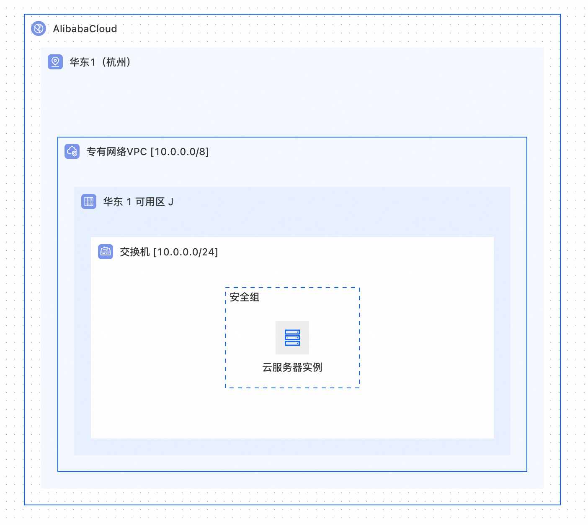
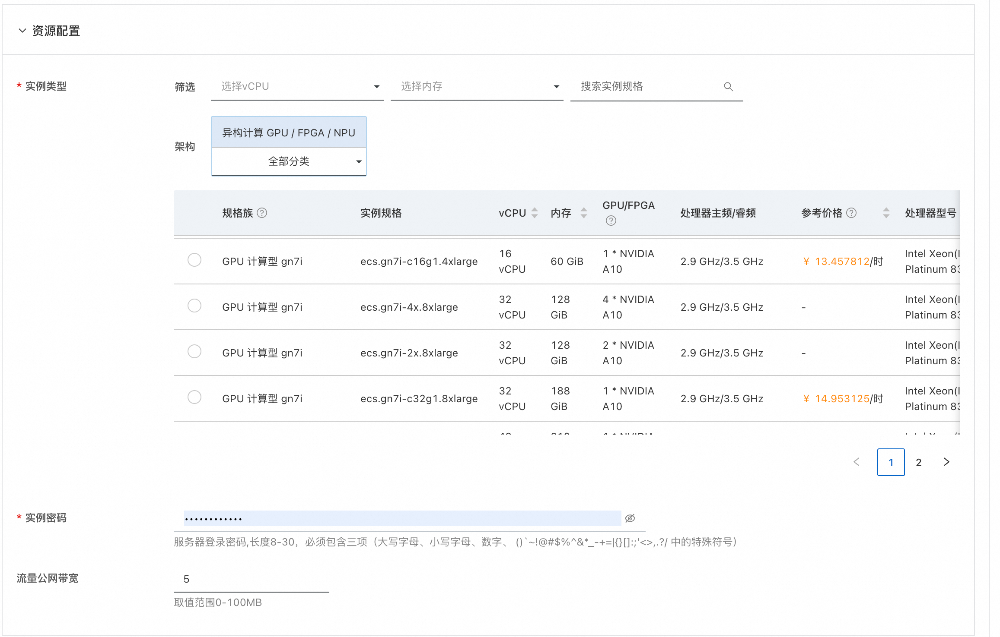
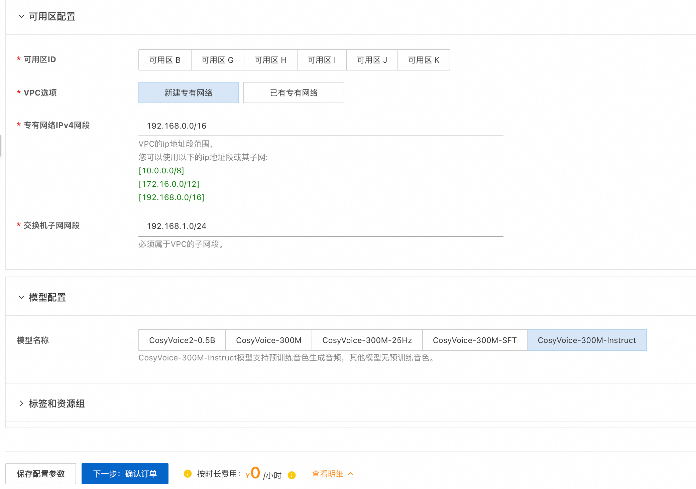
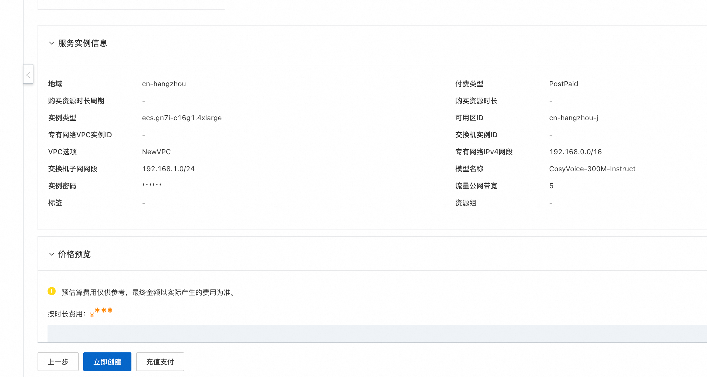
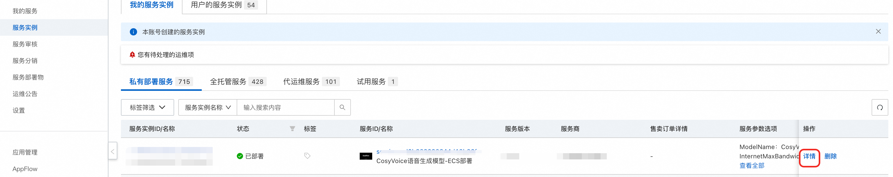
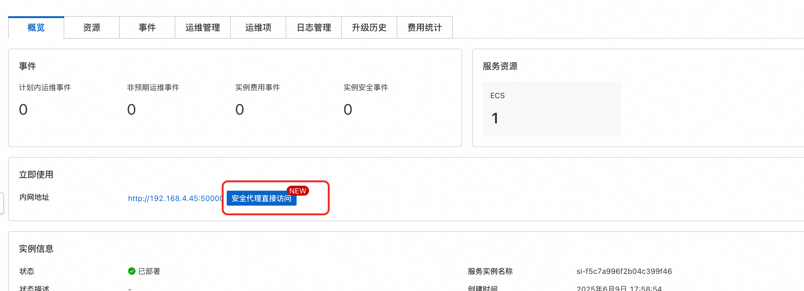
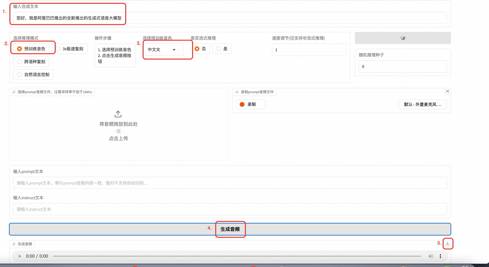
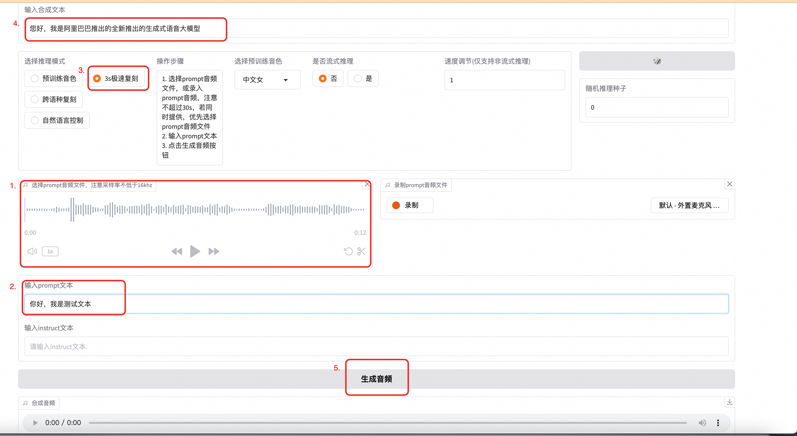
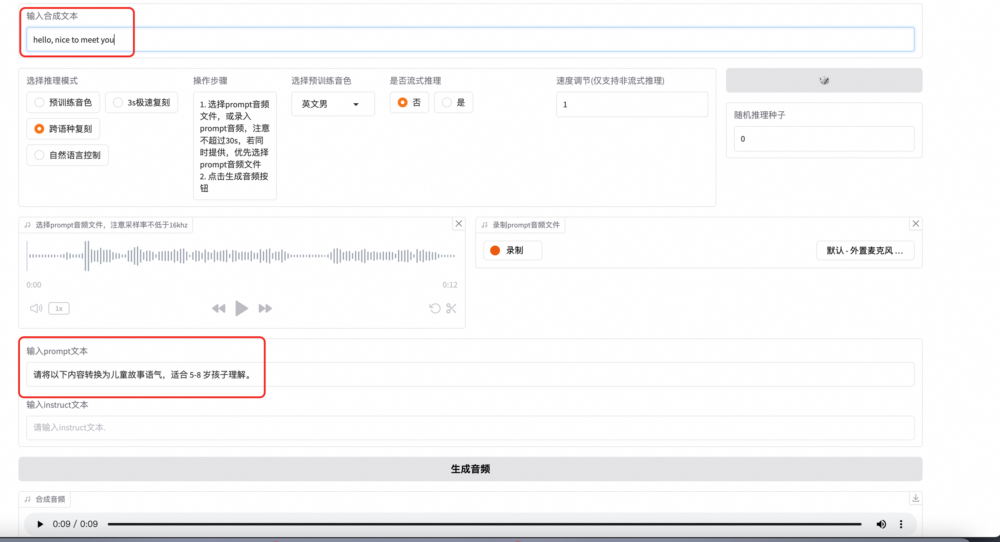
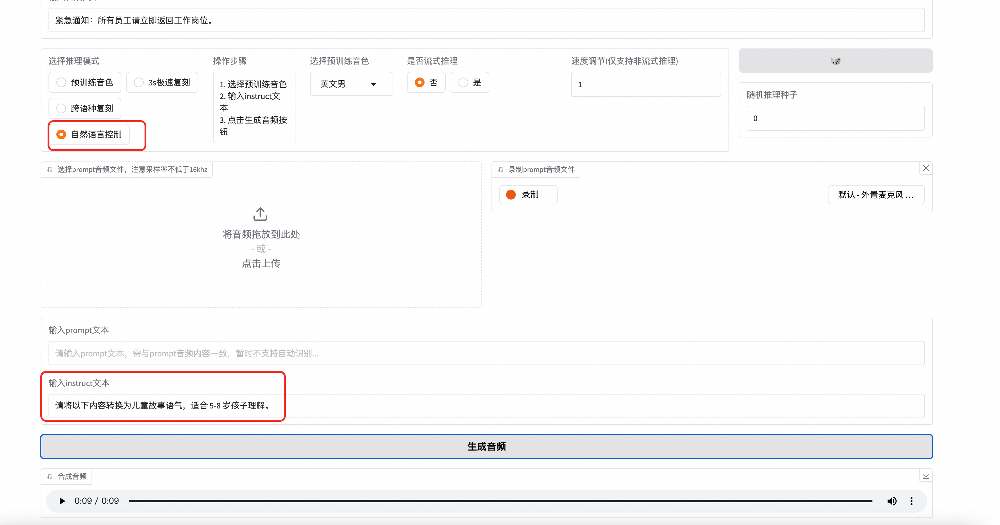

# CosyVoice语音生成模型-ECS部署

>**免责声明：**本服务由第三方提供，我们尽力确保其安全性、准确性和可靠性，但无法保证其完全免于故障、中断、错误或攻击。因此，本公司在此声明：对于本服务的内容、准确性、完整性、可靠性、适用性以及及时性不作任何陈述、保证或承诺，不对您使用本服务所产生的任何直接或间接的损失或损害承担任何责任；对于您通过本服务访问的第三方网站、应用程序、产品和服务，不对其内容、准确性、完整性、可靠性、适用性以及及时性承担任何责任，您应自行承担使用后果产生的风险和责任；对于因您使用本服务而产生的任何损失、损害，包括但不限于直接损失、间接损失、利润损失、商誉损失、数据损失或其他经济损失，不承担任何责任，即使本公司事先已被告知可能存在此类损失或损害的可能性；我们保留不时修改本声明的权利，因此请您在使用本服务前定期检查本声明。如果您对本声明或本服务存在任何问题或疑问，请联系我们。

## 概述
CosyVoice是阿里云推出的一款语音合成服务，它能够将文本转换成自然流畅的语音。这项服务支持多种语言和方言，可以满足不同场景下的需求，如新闻播报、有声读物制作、智能客服等。通过使用先进的深度学习技术，CosyVoice能够生成接近真人发声效果的声音，为用户提供更加丰富和人性化的交互体验。

多语言 
- 支持的语言: 中文、英文、日文、韩文、中文方言（粤语、四川话、上海话、天津话、武汉话等）
- 跨语言及混合语言：支持零样本的跨语言和代码转换场景的语音克隆。

超低延迟

- 双向流支持: CosyVoice 2.0 集成了离线和流式建模技术。
- 快速首包合成: 在保持高质量音频输出的同时，实现了低至150毫秒的延迟。

高精度
- 改进发音: 与CosyVoice 1.0相比，减少了30%到50%的发音错误。
- 基准测试成就: 在Seed-TTS评估集的困难测试集中达到了最低字符错误率。

强稳定性

- 音色一致性: 确保了在零样本和跨语言语音合成中的可靠音色一致性。
- 跨语言合成: 相比1.0版本有了显著提升。

自然体验
- 增强韵律和音质: 改善了合成音频的一致性，将MOS评分从5.4提高到了5.53。
- 情感和方言灵活性: 现在支持更多细粒度的情感控制和口音调整。

## 前提条件
<font style="color:rgb(51, 51, 51);">部署GCosyVoice语音生成模型-ECS部署服务实例，需要对部分阿里云资源进行访问和创建操作。因此您的账号需要包含如下资源的权限。</font><font style="color:rgb(51, 51, 51);"> </font>**<font style="color:rgb(51, 51, 51);">说明</font>**<font style="color:rgb(51, 51, 51);">：当您的账号是RAM账号时，才需要添加此权限。</font>

| <font style="color:rgb(51, 51, 51);">权限策略名称</font>                          | <font style="color:rgb(51, 51, 51);">备注</font>                         |
|-----------------------------------------------------------------------------|------------------------------------------------------------------------|
| <font style="color:rgb(51, 51, 51);">AliyunECSFullAccess</font>             | <font style="color:rgb(51, 51, 51);">管理云服务器服务（ECS）的权限</font>           |
| <font style="color:rgb(51, 51, 51);">AliyunVPCFullAccess</font>             | <font style="color:rgb(51, 51, 51);">管理专有网络（VPC）的权限</font>             |
| <font style="color:rgb(51, 51, 51);">AliyunROSFullAccess</font>             | <font style="color:rgb(51, 51, 51);">管理资源编排服务（ROS）的权限</font>           |
| <font style="color:rgb(51, 51, 51);">AliyunComputeNestUserFullAccess</font> | <font style="color:rgb(51, 51, 51);">管理计算巢服务（ComputeNest）的用户侧权限</font> |
| <font style="color:rgb(51, 51, 51);">AliyunComputeOSSFullAccess</font>      | <font style="color:rgb(51, 51, 51);">管理Oss的权限权限</font>                 |
| <font style="color:rgb(51, 51, 51);">AliyunCSFullAccess</font>      | <font style="color:rgb(51, 51, 51);">管理容器服务(CS)的权限</font>                 |


## 计费说明
<font style="color:rgb(51, 51, 51);"> CosyVoice语音生成模型-ECS部署在计算巢部署的费用主要涉及：</font>

+ <font style="color:rgb(51, 51, 51);">所选vCPU与内存规格</font>
+ <font style="color:rgb(51, 51, 51);">系统盘类型及容量</font>
+ <font style="color:rgb(51, 51, 51);">公网带宽</font>

## 部署架构


### 部署参数说明
您在创建服务实例的过程中，需要配置服务实例信息。下文介绍CosyVoice语音生成模型-ECS部署服务实例输入参数的详细信息.

| 参数组    | 参数项 | 示例                    | 说明                                                                      |
|--------|-----|-----------------------|-------------------------------------------------------------------------|
| 服务实例名称 |     | test                  | 实例的名称                                                                   |
| 地域     |     | 华东1（杭州）               | 选中服务实例的地域，建议就近选中，以获取更好的网络延时。                                            |
| 付费类型配置 | 付费类型| 按量付费                  |                                                                         |
| 资源配置   | 实例类型| ecs.gn7i-c8g1.2xlarge |                                                                         |
| 资源配置   | 实例密码|                       | 服务器登录密码,长度8-30，必须包含三项（大写字母、小写字母、数字、 ()`~!@#$%^&*_-+={}[]:;'<>,.?/ 中的特殊符号） |
| 资源配置   | 流量公网带宽| 5                     |                                                                         |
| 可用区配置  | 可用区ID| cn-hangzhou-a         |                                                                         |
| 可用区配置  | VPC选项| 新建专有网路                |                                                                         |
| 可用区配置  | VPC选项| 新建专有网路                |                                                                         |
| 可用区配置  | 专有网络VPC实例ID| vpc-xxxxx             |                                                                         |
| 可用区配置  | 交换机实例ID| vsw-xxxx              |                                                                         |
| 可用区配置  | 专有网络IPv4网段| 192.168.0.0/16             |                                                                         |
| 可用区配置  | 交换机子网网段| 192.168.1.0/24            |                                                                         |
| 模型配置   | 模型名称|CosyVoice-300M-Instruct            |                                                                         |


## 部署流程
1. 访问计算巢 [部署链接](https://computenest.console.aliyun.com/service/instance/create/default?type=user&ServiceName=CosyVoice语音生成模型-ECS部署)，按提示填写部署参数
2. 填写实例配置 
3. 填写可用区配置与模型配置，点击下一步：确认订单 。请注意，仅有CosyVoice-300M-Instruct模型有预训练音色，其他模型无法利用预训练音色生成语音。
4. 点击立即创建
5. 通过服务实例列表页进入服务实例详情，通过图中链接即可访问。请注意，promopt文件仅支持wav格式！其他样式不支持！
6. 使用方式：
<br>
如果您使用的是CosyVoice-300M-Instruct模型，则可以使用预训练音色生成语音，如图输入您需要生成的文案，选择预训练音色，点击生成即可。音频生成完成后即可点击下载查看生成效果。
<br>
<br>
如果您选择的是3秒极速复刻。您需要先录一段音频，可以读一段话，也可随便说点什么，不超过30秒，注意录音效果不能噪音很多。上传完成后，将您录音中的文案输入到prompt文本中
最后，输入合成文本后点击生成音频即可。最终生成的音频是根据生成文本，依靠您输入音频的音色生成的。
<br>
<br>
如果您使用的是跨语言复制，则需要输入prompt音频和文字。需要注意的是，需要确保合成文本和prompt文本为不同语言。
<br>
<br>
如果您使用的是自然语音控制，您可以在instruct填写控制文本，用于控制语气语速等。
7. 如果您想通过api访问服务，您可以使用下面的python代码通过sdk访问。请注意，需要将访问的ip更换为您服务器的公网ip，端口为80端口。另外需将your_valid_token更新为服务实例详情页，立即使用中的ApiKey
``` 
import argparse
import logging
import requests
import torch
import torchaudio
import numpy as np


def main():
    url = "http://{}:{}/inference_{}".format(args.host, args.port, args.mode)
    headers = {
        "X-API-TOKEN": "your_valid_token"  # 添加自定义 Header
    }
    if args.mode == 'sft':
        payload = {
            'tts_text': args.tts_text,
            'spk_id': args.spk_id
        }
        response = requests.request("GET", url, data=payload, stream=True, headers=headers)
    elif args.mode == 'zero_shot':
        payload = {
            'tts_text': args.tts_text,
            'prompt_text': args.prompt_text
        }
        files = [('prompt_wav', ('prompt_wav', open(args.prompt_wav, 'rb'), 'application/octet-stream'))]
        response = requests.request("GET", url, data=payload, files=files, stream=True, headers=headers)
    elif args.mode == 'cross_lingual':
        payload = {
            'tts_text': args.tts_text,
        }
        files = [('prompt_wav', ('prompt_wav', open(args.prompt_wav, 'rb'), 'application/octet-stream'))]
        response = requests.request("GET", url, data=payload, files=files, stream=True, headers=headers)
    else:
        payload = {
            'tts_text': args.tts_text,
            'spk_id': args.spk_id,
            'instruct_text': args.instruct_text
        }
        response = requests.request("GET", url, data=payload, stream=True, headers=headers)
    tts_audio = b''
    for r in response.iter_content(chunk_size=16000):
        tts_audio += r
    tts_speech = torch.from_numpy(np.array(np.frombuffer(tts_audio, dtype=np.int16))).unsqueeze(dim=0)
    logging.info('save response to {}'.format(args.tts_wav))
    torchaudio.save(args.tts_wav, tts_speech, target_sr)
    logging.info('get response')


if __name__ == "__main__":
    parser = argparse.ArgumentParser()
    parser.add_argument('--host',
                        type=str,
                        default='116.62.86.145')
    parser.add_argument('--port',
                        type=int,
                        default='80')
    parser.add_argument('--mode',
                        default='sft',
                        choices=['sft', 'zero_shot', 'cross_lingual', 'instruct'],
                        help='request mode')
    parser.add_argument('--tts_text',
                        type=str,
                        default='你好，我是通义千问语音合成大模型，请问有什么可以帮您的吗？')
    parser.add_argument('--spk_id',
                        type=str,
                        default='中文女')
    parser.add_argument('--prompt_text',
                        type=str,
                        default='希望你以后能够做的比我还好呦。')
    parser.add_argument('--prompt_wav',
                        type=str,
                        default='../../../asset/zero_shot_prompt.wav')
    parser.add_argument('--instruct_text',
                        type=str,
                        default='Theo \'Crimson\', is a fiery, passionate rebel leader. \
                                 Fights with fervor for justice, but struggles with impulsiveness.')
    parser.add_argument('--tts_wav',
                        type=str,
                        default='demo.wav')
    args = parser.parse_args()
    prompt_sr, target_sr = 16000, 22050
    main()

```